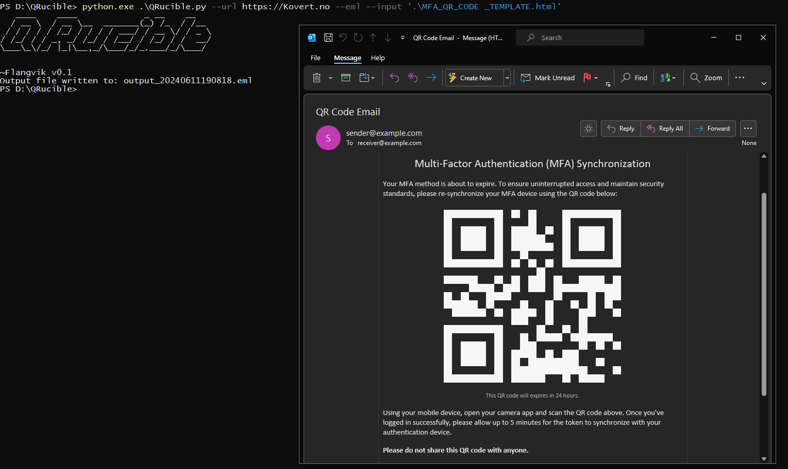
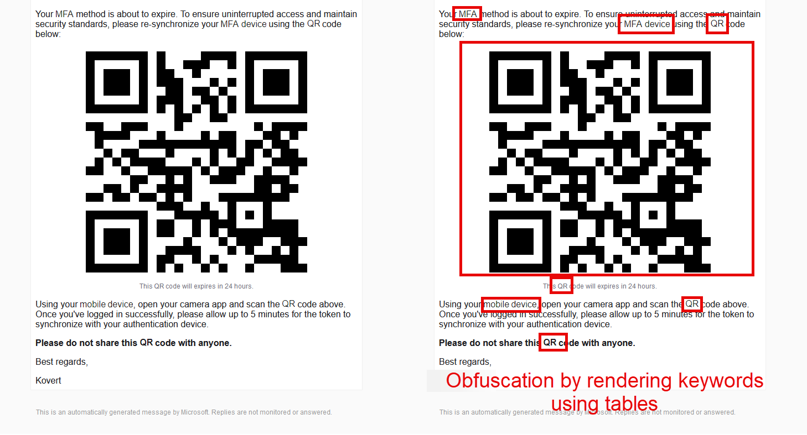

 <p align="center">
 
</p>

## QRucible

A tiny Python utility that generates "imageless" QR codes in various formats and obfuscates keywords in emails by illustrating them using tables. This is useful for evading keyword-based and AI-assisted QR code phishing-specific detections. Partially released with an accompanying [blog post](https://flangvik.com/posts/2024-06-13-pixelless-qr-codes-with-qrucible/) at x33fcon 2024, with more features added during Defcon 32.
## Install

```
pip3 install -r requirements.txt
python3 QRucible.py 
```

## Usage

```
usage: QRucible.py [-h] -u URL [-s SIZE] [-i INPUT] [-o OUTPUT] [--css] [--tables] [--eml] [--obfuscate OBFUSCATE [OBFUSCATE ...]]

A tiny Python utility that generates "imageless" QR codes in various formats and obfuscates keywords in emails

options:
  -h, --help            show this help message and exit
  -u URL, --url URL     The URL to be encoded in the QR code.
  -s SIZE, --size SIZE  The box size of the QR code. (default: 40)
  -i INPUT, --input INPUT
                        The input HTML (template) file, replaces the string QR_PLACEHOLDER with the QR code
  -o OUTPUT, --output OUTPUT
                        The output path to an HTML or EML file.
  --css                 Generate QR code using the CSS method.
  --tables              Generate QR code using the table method. Default
  --eml                 Generate an EML file instead of an HTML file.
  --obfuscate OBFUSCATE [OBFUSCATE ...]
                        Keywords to obfuscate by illustrating them as tables.
```

## CSS/Table QR Code Example
The below QR code is generated using HTML tables



## Keyword Obfuscation Example
The keywords marked in the email below are illustrated using tiny tables, not text, and will therefore confuse AI trying to understand context / bypass keyword flagging/detection.

# Credits

CSS method is based on this example: https://codepen.io/jasonadelia/pen/DwWaNW